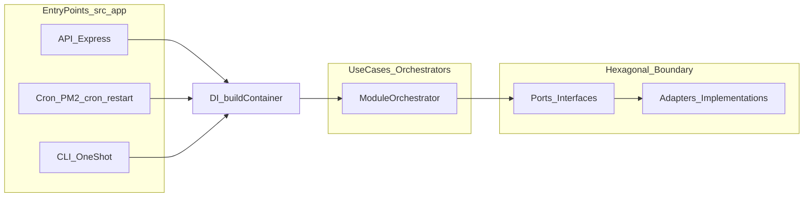

# new-bot-be

A Node.js + TypeScript backend skeleton that demonstrates a strict architecture:

- Modular monolith (`src/modules/*`)
- Use-case orchestrators (`src/modules/*/application`)
- Hexagonal architecture inside modules (Ports & Adapters)
- Express REST API and node-cron as entry-points (`src/app/*`)
- Dependency wiring only in the composition root (`src/app/di`)
- No business logic in API or Cron

## Runtime shape (at a glance)



## Docs (start here)

- `docs/README.md`
- `docs/Architecture.md`

## Requirements

- Node.js (LTS recommended)

## Install

```bash
npm install
```

## Commands

This section lists the commands you actually run day-to-day, with what they do and when to use them.

### Develop the API (hot reload)

- **Run the API server with file watching**:

```bash
npm run dev
```

- **What it does**: starts `src/app/api/server.ts` with `tsx watch` (hot reload).
- **Use when**: you’re working on HTTP routes or verifying API behavior locally.
- **Default port**: `3000` (override with `PORT`).
- **Quick smoke test**: `GET /api/health`.

### Run “cron jobs” locally (dev mode)

In this repo, “cron” entry points are just Node processes that trigger orchestrators. In production scheduling is owned by **PM2** via `cron_restart` (see `ecosystem.config.cjs`).

- **Health cron (dev/watch)**:

```bash
npm run dev:cron
```

- **News ingestion cron entry point (dev/watch)**:

```bash
npm run dev:cron:ingest
```

- **Publishing cron entry point (dev/watch)**:

```bash
npm run dev:cron:publish
```

- **What they do**: run the cron entry point TS files under `src/app/cron/` with `tsx watch`.
- **Use when**: you want to observe cron behavior locally (logs, wiring, error handling), without PM2.

### Run one-off use-cases (CLI)

- **Ingest news once (writes to SQLite)**:

```bash
npm run dev:cli:ingest
```

- **Ingest news once (dry-run, no DB writes)**:

```bash
npm run dev:cli:ingest:dry-run
```

- **Publish digest once**:

```bash
npm run dev:cli:publish
```

- **What they do**: run the CLI entry points under `src/app/cli/` once and exit.
- **Use when**: you want deterministic “run exactly once” behavior (great for debugging and manual ops).

### Ingestion prerequisites and configuration (local)

- **Install Playwright browser binaries (once per machine/CI image)**:

```bash
npx playwright install
```

- **Common env vars**:
  - **SQLite path**: `NEWS_BOT_SQLITE_PATH` (default: `./data/news-bot.sqlite`)
  - **Ingestion schedule label** (used for logging): `INGEST_CRON_SCHEDULE` (default: `*/5 * * * *`)
  - **Playwright UX/debug**:
    - `INGEST_SCRAPER_HEADLESS` (default: `true`)
    - `INGEST_SCRAPER_SLOWMO_MS` (optional)

### Test

```bash
npm test
```

### Build and run from `dist/` (production-like)

- **Build TypeScript**:

```bash
npm run build
```

- **Start the API from the build output**:

```bash
npm run start
```

- **Start cron entry points from the build output**:

```bash
npm run start:cron
npm run start:cron:ingest
npm run start:cron:publish
```

- **Run CLIs from the build output**:

```bash
npm run start:cli:ingest
npm run start:cli:publish
```

### Run with PM2 (scheduling + process management)

PM2 config:
- `ecosystem.config.cjs` (source of truth)
- `ecosystem.config.js` (wrapper so `pm2 start` works without args)

Recommended approach (via npm scripts):

```bash
npm run pm2:start
npm run pm2:reload
npm run pm2:restart
npm run pm2:stop
npm run pm2:delete
npm run pm2:list
npm run pm2:logs
npm run pm2:logs:cron
npm run pm2:save
npm run pm2:flush
```

What you’ll use most often:
- **Bring everything up**: `npm run pm2:start` (builds then `pm2 start ecosystem.config.js`)
- **Deploy updated build without downtime**: `npm run pm2:reload`
- **Tail only cron logs**: `npm run pm2:logs:cron`
- **Persist the current process list**: `npm run pm2:save`

Direct PM2 commands (equivalent to the scripts above):

```bash
pm2 start ecosystem.config.js
pm2 startOrReload ecosystem.config.js
pm2 restart ecosystem.config.js
pm2 stop ecosystem.config.js
pm2 delete ecosystem.config.js
pm2 list
pm2 logs
pm2 logs cron:boot-sequence cron:health cron:news:ingest cron:publishing:digest
pm2 save
pm2 flush
```
