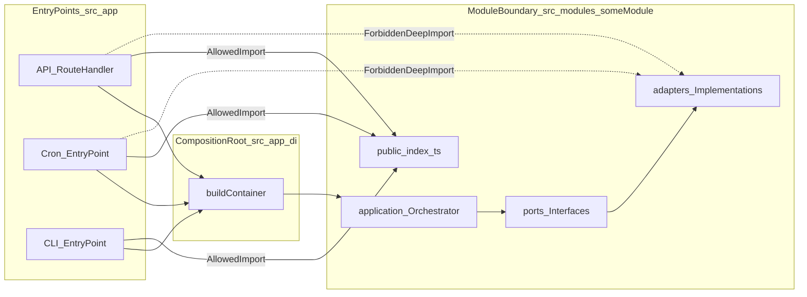

# Architecture

## Problem this project solves

This project is a **backend skeleton** that demonstrates how to structure a Node.js + TypeScript codebase so that:

- Business logic is **isolated** from infrastructure details (HTTP, cron scheduling).
- Use-cases are easy to test (no HTTP server or cron needed).
- External dependencies can be swapped with minimal impact.
- The codebase stays understandable as it grows (clear boundaries and ownership).

The repo includes realistic modules (ingestion, filtering, publishing, boot-time sequencing) and demonstrates how to keep use-cases testable while still integrating with infrastructure like SQLite, Playwright-based scraping, and external publishing APIs.

## Key decisions (and why)

### Modular Monolith

**Decision:** Keep one deployable application, but split business code into modules under `src/modules/*`.

**Why:**
- You get clear boundaries (like services) without the overhead of distributed systems.
- You can evolve modules independently while still refactoring safely in one repo.

### Use-case Orchestrators

**Decision:** Any code that answers “what happens, and in what order” lives in an **orchestrator** inside `src/modules/*/application`.

**Why:**
- Use-cases become the main unit of business behavior.
- Orchestrators are easy to test (pure inputs/outputs plus injected ports).
- Entry-points (HTTP/Cron) remain thin and predictable.
- One orchestrator represents exactly one business use-case.
- If behavior diverges, a new orchestrator must be introduced.

### Hexagonal Architecture (Ports & Adapters) inside modules

**Decision:** Orchestrators depend on **ports** (interfaces). **Adapters** implement those ports.

**Why:**
- Business logic does not know about libraries or runtime details.
- You can replace implementations (system time, HTTP client, storage) without touching use-case code.

## Strict placement rules (do not violate)

### Where business logic is allowed

- **Allowed:** `src/modules/*/application` (orchestrators) and module internals (`domain/` if/when introduced).
- **Forbidden:** any business logic inside `src/app/*`.

### Entry-points responsibilities (API / Cron)

Entry-points are infrastructure only. They may:
- Parse/validate input shape (basic).
- Call **one orchestrator**.
- Map orchestrator output to HTTP response or logs.
- Handle concerns like retries/logging at the edge (as infrastructure).

They must not:
- Decide business execution order.
- Call multiple modules in sequence.
- Instantiate adapters or orchestrators.

### Composition root responsibilities (DI)

Dependency wiring happens **only** in `src/app/di`.

It must:
- Instantiate adapters.
- Instantiate orchestrators with explicit dependency injection.
- Expose ready-to-use orchestrators for entry-points to call.

The DI container is rebuilt only at application startup, not per request.

### Module boundaries and Public API

Each module exposes a **Public API** at:

- `src/modules/<module>/public/index.ts`

Other code may import **only** from the Public API.

Allowed:

```ts
import { PublishDigestOrchestrator } from "../../modules/publishing/public";
```

Forbidden (deep import into module internals):

```ts
import { TelegramMarkdownPublisher } from "../../modules/publishing/adapters/TelegramMarkdownPublisher";
```

## Folder structure and responsibilities

### `src/app/` — infrastructure / entry-points only

```
src/app/
  api/    # Express HTTP entry-point (controllers/routes/server)
  cron/   # PM2-driven cron entry points (runners only)
  di/     # composition root (dependency wiring)
```

### `src/modules/` — business modules

```
src/modules/
  news-ingestion/
  news-filtering/
  news-pipeline/
  publishing/
```

### `src/shared/` — cross-cutting utilities
**Important:** `shared/` must not contain business rules or use-case logic.
```
src/shared/
  observability/  # logging/tracing abstractions
  utils/          # generic helpers (if needed)
  types/          # shared type shims (e.g., external library typings)
```

## How the system works end-to-end

The runtime shape is always:

**Entry-point → DI container → Orchestrator → Ports → Adapters**



### API flow: `GET /api/digests`

1. `src/app/api/server.ts` builds the container with `buildContainer()`.
2. `src/app/api/routes/digestsRoute.ts` handles `GET /api/digests`.
3. The route handler calls the orchestrator instance from the container.
4. The orchestrator returns a DTO. The handler returns it as JSON.

High-signal excerpt (entry-point calls orchestrator only):

```ts
// src/app/api/routes/digestsRoute.ts
const digests = await container.publishing.listDigests.run();
res.json(digests);
```

### Cron flow: scheduled ingestion run

1. `src/app/cron/newsIngestCron.ts` builds the container once with `buildContainer()`.
2. PM2 schedules restarts via `cron_restart` (see `ecosystem.config.cjs`).
3. On each scheduled restart, the entry point calls the orchestrator and logs a summarized result.

High-signal excerpt:

```ts
// src/app/cron/newsIngestCron.ts
const result = await container.ingest.news.run({ dryRun: false });
container.logger.info("cron:news:ingestion:done", { storedCount: result.storedCount });
```

## Practical guidance for adding new behavior

- Add a new use-case:
  - create an orchestrator in `src/modules/<module>/application`
  - define any required ports in `src/modules/<module>/ports`
  - implement ports in `src/modules/<module>/adapters`
  - export orchestrator + DTOs from `src/modules/<module>/public/index.ts`
  - wire dependencies in `src/app/di/container.ts`
  - call the orchestrator from `src/app/api` or `src/app/cron` as an entry-point

If you follow this path, the boundaries stay consistent and the system remains easy to test and reason about.

