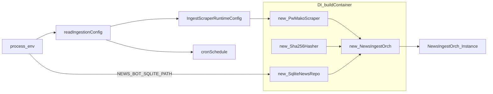

# Ingestion configuration (INGEST_* env vars, DI consumption)

## Purpose / scope

This document defines:

- The canonical env var keys for ingestion configuration.
- Defaults and how they are parsed.
- How configuration flows into adapter instantiation (DI container).
- Which variables are **generic system variables** vs ingestion-specific.

## Where it lives

Module-owned config helper:

- `src/modules/news-ingestion/public/ingestionEnv.ts`

Consumption (DI + entry points):

- `src/app/di/container.ts`
- `src/app/cron/newsIngestCron.ts`
- `src/app/cli/newsIngestCli.ts`

## Principles

### Module owns its config contract

Env var keys for ingestion are centralized inside the module and exported via the module Public API:

- `INGEST_ENV` (env var key constants)
- `readIngestionConfig(env)` (parsing + defaults)

This ensures `src/app/*` does not hardcode ingestion env var names.

### Generic variables remain generic

- `PORT` (API server port): used by `src/app/api/server.ts` (not ingestion-specific).
- `NEWS_BOT_SQLITE_PATH` (DB file path): used by DI to configure the SQLite adapter.

This repo intentionally does **not** store ingestion variables in `.env` / `.env.local`.

## Canonical ingestion env vars

All ingestion env keys are in:

- `INGEST_ENV` from `src/modules/news-ingestion/public/ingestionEnv.ts`

### `INGEST_CRON_SCHEDULE`

- **Key**: `INGEST_ENV.CRON_SCHEDULE`
- **Used by**: `src/app/cron/newsIngestCron.ts`
- **Default**: `*/5 * * * *`
- **Meaning**: Cron expression (PM2 `cron_restart`) controlling ingestion schedule.

### `INGEST_SCRAPER_HEADLESS`

- **Key**: `INGEST_ENV.SCRAPER_HEADLESS`
- **Used by**: DI when creating `PwMakoScraper`
- **Default**: `true`
- **Accepted values**:
  - truthy: `1`, `true`, `yes`, `y`, `on`
  - falsy: `0`, `false`, `no`, `n`, `off`
- **Meaning**:
  - `true`: run Playwright headless
  - `false`: show browser UI (debugging / bot-protection troubleshooting)

### `INGEST_SCRAPER_SLOWMO_MS`

- **Key**: `INGEST_ENV.SCRAPER_SLOWMO_MS`
- **Used by**: DI when creating `PwMakoScraper`
- **Default**: unset (no slow motion)
- **Meaning**: Adds a delay (ms) between Playwright actions (useful in headful mode).

### `INGEST_USER_DATA_DIR`

- **Key**: `INGEST_ENV.USER_DATA_DIR`
- **Used by**: DI when creating `PwMakoScraper`
- **Default**: unset
- **Meaning**:
  - When set, ingestion uses a **persistent browser context**.
  - This persists cookies / localStorage across runs and can help with bot protections.

### `INGEST_CHROMIUM_CHANNEL`

- **Key**: `INGEST_ENV.CHROMIUM_CHANNEL`
- **Used by**: DI when creating `PwMakoScraper`
- **Default**: unset (Playwright bundled Chromium)
- **Allowed values**: `chrome` | `msedge`
- **Meaning**:
  - Use system-installed Chrome/Edge instead of Playwright’s bundled Chromium.
  - Useful if your environment manages browsers externally.

### `INGEST_USER_AGENT`

- **Key**: `INGEST_ENV.USER_AGENT`
- **Default**: unset (adapter has its own default)
- **Meaning**: Overrides user-agent for Playwright browser context.

### `INGEST_LOCALE`

- **Key**: `INGEST_ENV.LOCALE`
- **Default**: unset (adapter default: `he-IL`)
- **Meaning**: Locale used in Playwright context.

### `INGEST_TIMEZONE`

- **Key**: `INGEST_ENV.TIMEZONE`
- **Default**: unset (adapter default: `Asia/Jerusalem`)
- **Meaning**: Timezone used in Playwright context.

## How parsing works (`readIngestionConfig`)

`readIngestionConfig(env)` returns:

- `cronSchedule: string`
- `scraper: IngestScraperRuntimeConfig`

Parsing details:

- Cron schedule is a simple string with a default.
- Boolean parsing supports multiple truthy/falsy strings (see above).
- Number parsing returns `undefined` if missing/empty/non-finite.
- Optional strings are included only if non-empty.
- `INGEST_CHROMIUM_CHANNEL` is validated to `chrome` or `msedge`.

## How config reaches adapters (DI)

DI container (`src/app/di/container.ts`) does:

1. Read sqlite path:
   - `NEWS_BOT_SQLITE_PATH ?? "./data/news-bot.sqlite"`
2. Read ingestion config:
   - `const ingestCfg = readIngestionConfig(process.env)`
3. Instantiate adapters:
   - `new PwMakoScraper({ ...ingestCfg.scraper })`
   - `new Sha256Hasher()`
   - `new SqliteNewsRepo({ sqlitePath })`
4. Instantiate orchestrator:
   - `new NewsIngestOrch({ scraper, hasher, repository, logger })`

This keeps env var parsing and defaults centralized, and the system wiring explicit.

## Playwright browser binaries requirement

The repo depends on Playwright, but does not auto-install browser binaries.

If you see errors like “Executable doesn’t exist”, install browsers once:

- `npx playwright install`

This is intentionally left to the developer/CI environment.

