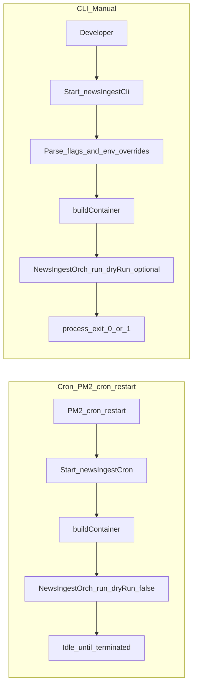

# Ingestion entry points (Cron + CLI participation)

## Purpose / scope

This document explains how ingestion participates in the system runtime via:

- Cron scheduler (`node-cron`)
- CLI manual trigger

It focuses on lifecycle and responsibilities:

- what entry points are allowed to do
- what they must not do (business flow ownership)

## Where it lives

- Cron entry point: `src/app/cron/newsIngestCron.ts`
- CLI entry point: `src/app/cli/newsIngestCli.ts`
- DI container: `src/app/di/container.ts`
- Orchestrator: `src/modules/news-ingestion/application/NewsIngestOrch.ts`

## Entry-point boundary rules (must hold)

Entry points must be **thin**:

- parse inputs (flags / env) if needed
- build DI container once
- call exactly **one** orchestrator
- log start/end/error

Entry points must **not**:

- scrape the page themselves
- hash content
- query or write SQLite directly
- coordinate multiple steps or multiple modules in sequence

## Cron: `newsIngestCron.ts`

### Purpose

Run ingestion repeatedly on a schedule.

### Schedule configuration

Cron reads the schedule string from the module config (for logging/context):

- `readIngestionConfig(process.env).cronSchedule`

Default value is set in the module config helper:

- `*/5 * * * *` (every 5 minutes)

PM2 is responsible for scheduling:

- `ecosystem.config.cjs` defines the schedule via `cron_restart`.
- The cron process does **not** schedule itself in-process.

### Lifecycle

1. Process starts
2. Cron entry point builds DI container once via `buildContainer()`
3. It logs that the scheduler started (with `{ schedule }`)
4. It runs the orchestrator once with `dryRun: false`
5. It stays alive (idle) until terminated
6. PM2 restarts the process on schedule; each restart triggers one run

### What Cron logs

It emits:

- `Cron scheduler started (news ingestion).` with `{ schedule }` once on startup
- For each run:
  - `cron:news:ingestion:start` with `{ schedule }`
  - `cron:news:ingestion:done` with `{ durationMs, source, dryRun, scrapedCount, newItemsCount, storedCount }`
  - `cron:news:ingestion:error` with `{ durationMs, error }` on failure

### Error behavior

Cron does not crash the process on an ingestion failure:

- errors are logged
- subsequent scheduled runs still happen (PM2 restarts on schedule)

If you need retries/backoff, that is an **infrastructure concern** that belongs in the cron entry point (or a wrapper around it), but the use-case flow ordering must remain in the orchestrator.

## CLI: `newsIngestCli.ts`

### Purpose

Manually run ingestion once from the command line, reusing the exact same orchestrator wiring as cron.

### Flags

- `--dry-run`
  - run the entire flow (scrape/hash/filter)
  - do **not** write to SQLite
- `--headful` or `--headed`
  - force Playwright to show the browser UI by setting `INGEST_SCRAPER_HEADLESS=false`
- `--slowmo-ms=<number>`
  - sets `INGEST_SCRAPER_SLOWMO_MS` to slow down visible browser actions

### How flags affect config

CLI overrides are done by setting env vars using module-owned keys:

- `process.env[INGEST_ENV.SCRAPER_HEADLESS] = "false"`
- `process.env[INGEST_ENV.SCRAPER_SLOWMO_MS] = "150"` (example)

This is intentionally done before building the container so the scraper is instantiated with the overridden config.

### Lifecycle

1. Parse flags from `process.argv`
2. Apply env overrides for scraper visibility / slow motion (optional)
3. Build DI container once via `buildContainer()`
4. Run orchestrator once:
   - `container.ingest.news.run({ dryRun })`
5. Log done/error
6. Explicitly terminate:
   - `process.exit(0)` on success
   - `process.exit(1)` on error

### What CLI logs

It emits:

- `cli:news:ingestion:start` with `{ dryRun }`
- `cli:news:ingestion:done` with summary `{ durationMs, source, dryRun, scrapedCount, newItemsCount, storedCount }`
- `cli:news:ingestion:error` with `{ durationMs, error }`

## Composition root participation

Both Cron and CLI build dependencies through:

- `src/app/di/container.ts`

The container:

- instantiates `PwMakoScraper` with config from `readIngestionConfig(process.env)`
- instantiates `Sha256Hasher`
- instantiates `SqliteNewsRepo` using `NEWS_BOT_SQLITE_PATH`
- wires them into a single `NewsIngestOrch` instance

This preserves:

- testability (orchestrator is pure + injected ports)
- explicit boundaries (adapters only in DI)

