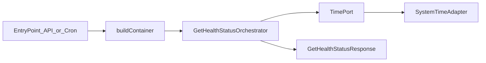

# Module: `health`

## Purpose / scope

The `health` module is the minimal example module in this repository. It exists to demonstrate the architecture rules:

- Orchestrators live in `src/modules/*/application`.
- Orchestrators depend on **ports**, not adapters.
- Entry points (`src/app/*`) call orchestrators only.
- Adapters/orchestrators are instantiated only in the DI container (`src/app/di/container.ts`).
- Cross-layer imports happen only through the module Public API.

## Where it lives

- Module root: `src/modules/health/`
- Public API: `src/modules/health/public/index.ts`

## Ownership

The module owns the use-case:

- “Return current health status”

It does not own persistence or scraping; it only uses time.

## Public API (`src/modules/health/public/index.ts`)

This is the only allowed import surface for app entry points and other modules.

It exports:

- `GetHealthStatusOrchestrator` (the use-case orchestrator)
- `GetHealthStatusResponse` (the response DTO type)
- `TimePort` (port type)
- `createSystemTimePort()` (factory returning a `TimePort` implementation)

### Note on adapter exposure

This module currently exposes a `createSystemTimePort()` factory from the Public API, which internally instantiates `SystemTimeAdapter`.

This is a pragmatic convenience so DI can avoid deep-importing adapters.

If you enforce a stricter rule of “Public API exports only orchestrators/DTOs/port types”, you can remove this factory and instantiate `SystemTimeAdapter` directly in DI instead.

## Orchestrator: `GetHealthStatusOrchestrator`

File:

- `src/modules/health/application/GetHealthStatusOrchestrator.ts`

### Responsibility

Define the use-case flow:

1. Ask the time port for current time (ISO string).
2. Return `{ status: "ok", time }`.

### Dependency

Constructor takes a single port:

- `TimePort`

This keeps business logic independent of runtime implementation.

## Port: `TimePort`

File:

- `src/modules/health/ports/TimePort.ts`

Contract:

- `nowIso(): string`

This is the hexagonal boundary that allows:

- real time in production (system adapter)
- fake time in tests

## Adapter: `SystemTimeAdapter`

File:

- `src/modules/health/adapters/SystemTimeAdapter.ts`

Implements:

- `TimePort`

Behavior:

- Returns `new Date().toISOString()`.

This is infrastructure code; it must not contain business flow logic.

## DTO: `GetHealthStatusResponse`

File:

- `src/modules/health/dto/GetHealthStatusResponse.ts`

Shape:

- `status: "ok"`
- `time: string` (ISO-8601)

## Runtime integration

### DI wiring

File:

- `src/app/di/container.ts`

Wiring steps:

1. Create a `TimePort` implementation (via `createSystemTimePort()`).
2. Construct `GetHealthStatusOrchestrator(timePort)`.
3. Expose it on `container.health.getHealthStatusOrchestrator`.

### API entry point usage

Files:

- `src/app/api/server.ts`
- `src/app/api/routes/healthRoute.ts`

Flow:

1. API builds container once.
2. `GET /api/health` handler calls the orchestrator:
   - `container.health.getHealthStatusOrchestrator.run()`
3. Returns the DTO as JSON.

### Cron entry point usage

File:

- `src/app/cron/healthCron.ts`

Flow:

1. Cron builds container once.
2. Scheduled tick calls the orchestrator and logs the DTO.

## Tests

File:

- `src/modules/health/tests/GetHealthStatusOrchestrator.test.ts`

Testing strategy:

- Pass a mocked `TimePort` returning a known ISO string.
- Assert the returned DTO matches.

## Extension points

- Add more health-related use-cases by adding new orchestrators under `application/`.
- Add richer status checks by:
  - defining new ports (e.g., DB connectivity, external health checks)
  - implementing adapters
  - wiring in DI

## Related docs

- `docs/Overview.md`
- `docs/Architecture.md`
- `docs/system/DependencyInjection.md`

