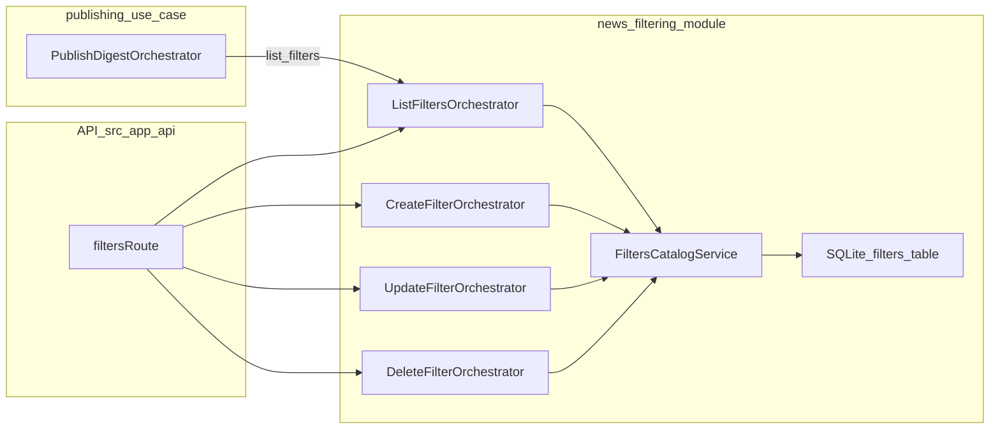

# Module: `news-filtering`

## Purpose / scope
The `news-filtering` module owns the catalog of **regex filters** used to exclude news items from digest generation.

It provides:
- CRUD use-cases for filters (via orchestrators).
- A persistence-backed catalog service (`filters` table in SQLite).

It does **not** apply filters to news items. Applying filters is owned by the publishing use-case flow (`PublishDigestOrchestrator`).

## Where it lives
- Module root: `src/modules/news-filtering/`
- Public API: `src/modules/news-filtering/public/index.ts`

## Ownership
This module owns the filter catalog use-cases:
- `ListFiltersOrchestrator`
- `CreateFilterOrchestrator`
- `UpdateFilterOrchestrator`
- `DeleteFilterOrchestrator`

## Public API (`src/modules/news-filtering/public/index.ts`)
Exports (contracts only):
- DTOs:
  - `FilterDto` (mirrors SQLite `filters` column names)
- Orchestrators:
  - `ListFiltersOrchestrator`
  - `CreateFilterOrchestrator` + `CreateFilterInput`
  - `UpdateFilterOrchestrator` + `UpdateFilterInput`
  - `DeleteFilterOrchestrator` + `DeleteFilterInput`
- Service:
  - `FiltersCatalogService` (persistence-backed catalog)

Adapters are not exported; the catalog service opens SQLite internally using the injected `sqlitePath`.

## Storage
The module creates/uses a SQLite table:
- `filters`

Columns:
- `id` (autoincrement)
- `created_at`, `updated_at` (UTC ISO strings)
- `name` (unique)
- `pattern` (regex source string)

## Runtime integration
- API routes:
  - `GET /api/filters`
  - `POST /api/filters`
  - `PUT /api/filters/:id`
  - `DELETE /api/filters/:id`
- Publishing integration:
  - `PublishDigestOrchestrator` loads filters via `ListFiltersOrchestrator` (injected via DI).

## Related docs
- `docs/modules/publishing.md` (filter application occurs here)
- `docs/api/README.md` (filters endpoints)

