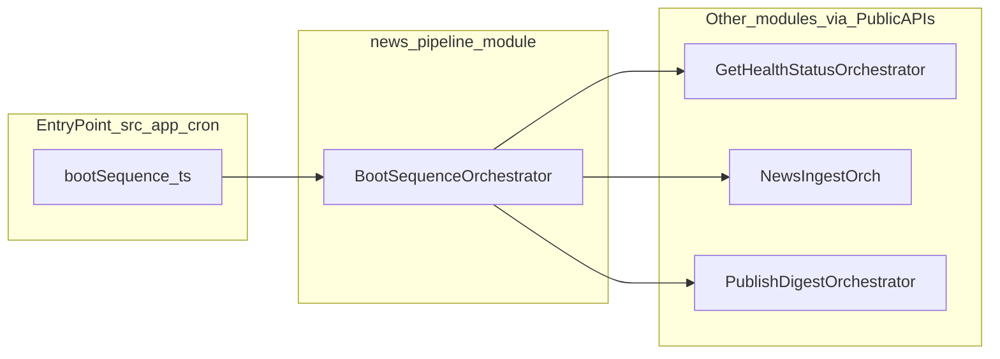

# Module: `news-pipeline`

## Purpose / scope
The `news-pipeline` module owns cross-module business flows that do not clearly belong to a single existing module.

In this repo, its primary responsibility is **boot-time sequencing**:

**health → ingest → publishing**

## Where it lives
- Module root: `src/modules/news-pipeline/`
- Orchestrator: `src/modules/news-pipeline/application/BootSequenceOrchestrator.ts`

## Ownership
The module owns the orchestrator:
- `BootSequenceOrchestrator`

## Cross-module boundary rule
`BootSequenceOrchestrator` depends on other modules **only via their Public APIs**:
- `src/modules/health/public`
- `src/modules/news-ingestion/public`
- `src/modules/publishing/public`

It owns ordering and returns a structured result with per-step success/failure so callers can decide logging/alerting behavior.

## Runtime integration
- Entry point: `src/app/cron/bootSequence.ts`
- Scheduling: PM2 starts `cron:boot-sequence` immediately (see `ecosystem.config.cjs`).

## Related docs
- `docs/system/Lifecycle.md` (boot-time ordering + PM2 model)
- `docs/system/SystemArchitectureDiagram.md` (boot sequence diagram)

