# Module: `publishing`

## Purpose / scope

The `publishing` module owns the use-case of turning **unprocessed** ingested news items into a **single digest**, publishing it to an external destination, and tracking publish status.

In the current implementation:
- input is read from SQLite table `news_items`
- a digest is generated via an LLM adapter (Gemini)
- the digest is published via a publisher adapter (Telegram)
- the resulting digest is stored in SQLite table `digests` and marked as published on success

## Where it lives

- Module root: `src/modules/publishing/`
- Public API: `src/modules/publishing/public/index.ts`

## Ownership

The module owns one flow orchestrator:

- `PublishDigestOrchestrator`

Additionally, it owns catalog/config use-cases:
- `GetLlmConfigOrchestrator`, `UpsertLlmConfigOrchestrator`
- LLM catalog CRUD orchestrators (LLMs + models)

## Public API (`src/modules/publishing/public/index.ts`)

Exports (contracts only):

- Orchestrator:
  - `PublishDigestOrchestrator`
- DTOs:
  - `PublishDigestResult`
- Ports:
  - `NewsSelectionPort`
  - `TextGenerationPort`
  - `MarkdownPublisherPort`
  - `DigestRepositoryPort`

Adapters are intentionally not exported. They are instantiated in DI.

## Orchestrator: `PublishDigestOrchestrator`

File:

- `src/modules/publishing/application/PublishDigestOrchestrator.ts`

### Responsibility (flow owner)

This orchestrator owns the full use-case ordering:

```mermaid
flowchart LR
  Select[Select_unprocessed_news_items] --> LoadFilters[ListFiltersOrchestrator_news_filtering]
  LoadFilters --> Match[Match_filters_against_raw_text]
  Match --> Finalize[Mark_filtered_and_processed]
  Match --> Candidates[Keep_digest_candidates]
  Candidates --> NoCandidates{{"No_candidates?"}}
  NoCandidates -->|Yes| EarlyExitAllFiltered[EarlyExit_all_items_filtered]
  NoCandidates -->|No| LoadCfg[Load_llm_config]
  LoadCfg --> Generate[Generate_digest_via_TextGenerationPort]
  Generate --> Normalize[Normalize_digest_text]
  Normalize --> PersistPending[Persist_pending_digest_and_mark_items_processed]
  PersistPending --> Publish[Publish_via_MarkdownPublisherPort]
  Publish --> MarkPublished[Mark_digest_published]
```



1. Select rows from `news_items` where `processed = 0` (`ORDER BY id ASC`).
2. Load all configured regex filters from the `news-filtering` module.
3. For each selected item:
   - If it matches any filter:
     - mark the item as `filtered = 1`
     - persist `filters_ids` as the JSON array of matching filter ids
     - mark the item as `processed = 1` (so it stops reappearing)
   - Otherwise, keep it as a candidate for digest generation.
2. Load LLM config from SQLite table `llm_config` (single row with `id = 1`).
3. Generate a digest using `TextGenerationPort` using the DB-provided `model` + `instructions`.
4. Normalize the digest text minimally and deterministically.
4. Persist a pending digest to `digests` and mark selected `news_items` as processed (atomic).
5. Publish the digest using `MarkdownPublisherPort`.
6. Mark the digest as published (`is_published = 1`) only after the publisher succeeds.

### Logs

- `publishing:digest:start`
- `publishing:digest:early-exit:no-unprocessed-items`
- `publishing:digest:early-exit:all-items-filtered`
- `publishing:digest:done`

## Ports

### `NewsSelectionPort`

Returns **strings** (not objects). The SQLite adapter returns JSON strings for deterministic traceability:

```json
{ "id": 123, "rawText": "..." }
```

### `TextGenerationPort`

Provider-agnostic interface for generating text from a prompt. The concrete Gemini adapter is a module-internal implementation.

### `MarkdownPublisherPort`

Provider-agnostic interface for publishing Markdown text. The concrete Telegram adapter is a module-internal implementation.

### `DigestRepositoryPort`

Persists digests and tracks publish state (`is_published`).

## Storage

### `llms` (LLM providers)

Stores LLM providers (e.g. Gemini).

Schema:
- `id` — integer primary key.
- `name` — unique provider name (e.g. `gemini`).
- `alias` — display label (e.g. `Gemini`).

### `llm_models` (models)

Stores models linked to an LLM provider.

Schema:
- `id` — integer primary key.
- `llm_id` — foreign key to `llms.id`.
- `name` — unique model name (e.g. `gemini-2.0-flash-lite`).

### `llm_config`

The publishing flow depends on a single-row config table:

- `llm_config`

Schema (single row):
- `id` — must be `1` (enforced by `CHECK(id = 1)`).
- `model_id` — foreign key to `llm_models.id`.
- `instructions` — non-empty string.
- `updated_at` — ISO string.

Runtime rules:
- If the table exists but has **no row**, the publishing flow throws a fatal error and stops execution.
- If the row exists but the resolved model name or `instructions` are invalid (empty strings), the publishing flow **skips execution** (early exit) without calling the LLM.

API contract note:
- The `/api/llm-config` surface continues to expose `model` as a **model name string**, even though the DB stores `model_id`.

### `digests`

The module stores digests in a dedicated SQLite table:

- `digests`

Key fields:
- `digest_text` — the Markdown digest body.
- `is_published` — publish status flag (0/1).
- `source_item_ids_json` — traceability back to the source `news_items`.
- `source_news_texts_json` — exact prompt inputs used (debuggability).

Source rows are tracked via:

- `news_items.processed` (0/1)
- `news_items.filtered` (0/1; derived by applying filters)
- `news_items.filters_ids` (JSON array of matched filter ids)

## Runtime integration

### DI wiring

File:

- `src/app/di/container.ts`

Exposed as:

- `container.publishing.publishDigest`

### CLI entry point

File:

- `src/app/cli/publishDigestCli.ts`

Behavior:

- loads `.env` and `.env.local` if present
- calls the orchestrator once and exits explicitly

## Environment variables

The publishing flow requires:

- `GEMINI_API_KEY`
- `TELEGRAM_BOT_TOKEN`
- `TELEGRAM_CHAT_ID`
- `TELEGRAM_PARSE_MODE` (recommended: `MarkdownV2`)
- `TELEGRAM_DISABLE_PREVIEW`

