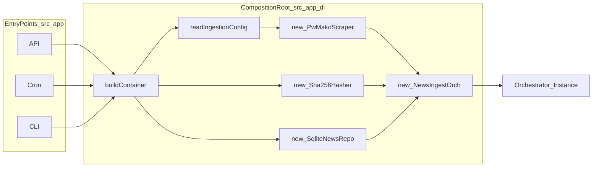

# Dependency Injection (composition root + wiring rules)

## Purpose / scope

This document explains:

- Why DI exists in this repo (explicit boundaries, testability).
- What the composition root is allowed to do.
- How modules expose contracts via Public APIs.
- How ingestion is wired (ports/adapters/orchestrator).

## Where it lives

Composition root:

- `src/app/di/container.ts`

Module Public APIs:

- `src/modules/health/public/index.ts`
- `src/modules/news-ingestion/public/index.ts`

## DI principles in this repo

### Explicit DI (no container framework)

The repo uses a hand-written container function:

- `buildContainer(): AppContainer`

This is intentional:

- wiring stays readable
- boundaries are obvious
- constructors show dependencies

### Build once per process

Entry points build the container once during startup and reuse the orchestrator instances.

They do not rebuild the container per request/tick.

### The only place that may instantiate adapters/orchestrators

Only the composition root may call `new` for adapters and orchestrators.

Entry points must not:

- instantiate adapters
- instantiate orchestrators
- import module internals

## Module Public API rule (no deep imports)

Each module provides a single import surface:

- `src/modules/<module>/public/index.ts`

Allowed imports (from app layer):

- import orchestrators and public types from `.../public`

Forbidden:

- importing adapters from `.../adapters/*`
- importing orchestrators from `.../application/*` directly

Why:

- keeps boundaries stable as the module evolves
- prevents leakage of infrastructure details

## Container shape

`AppContainer` exposes orchestrators (not adapters) to entry points:

- `health.getHealthStatusOrchestrator`
- `ingest.news` (ingestion orchestrator)

It also exposes a shared logger:

- `logger` from `src/shared/observability/logger.ts`

## Wiring: Health module

Health is a small example of hexagonal wiring:

- Port: `TimePort`
- Adapter: `SystemTimeAdapter`
- Orchestrator: `GetHealthStatusOrchestrator`

In the container:

1. Create time adapter (via helper from module public API).
2. Construct orchestrator with the port implementation.

## Wiring: Ingestion module (`news-ingestion`)

Ingestion is a more realistic multi-step use-case with multiple ports/adapters:

### 1) Read config (module-owned)

The ingestion module owns its env contract:

- `readIngestionConfig(process.env)` from `src/modules/news-ingestion/public`

This returns:

- `cronSchedule` (used by cron entry point)
- `scraper` config (used by DI to instantiate `PwMakoScraper`)

The app layer does not hardcode `INGEST_*` env names; it consumes module config.

### 2) Instantiate adapters

The container instantiates:

- Scraper adapter: `new PwMakoScraper({ ...ingestCfg.scraper })`
- Hashing adapter: `new Sha256Hasher()`
- Repository adapter: `new SqliteNewsRepo({ sqlitePath })`

`sqlitePath` is derived from a generic env var:

- `NEWS_BOT_SQLITE_PATH ?? "./data/news-bot.sqlite"`

### 3) Instantiate the orchestrator

The container wires the adapters into:

- `new NewsIngestOrch({ scraper, hasher, repository, logger })`

This preserves the boundary:

- orchestrator depends only on ports + shared logger interface
- adapters implement ports

## How DI supports testability

Because the orchestrator depends on ports:

- unit tests can pass in lightweight mocks/fakes
- no Playwright browser or SQLite DB is needed to test business flow logic

See:

- `src/modules/news-ingestion/tests/NewsIngestOrch.test.ts`

## Common DI pitfalls (avoid)

- **Putting flow logic in entry points**: ordering must stay in the orchestrator.
- **Exporting adapters from module public API**: adapters are infrastructure; keep them internal and instantiate them only in DI.
- **Deep imports into module internals**: breaks encapsulation and creates hidden coupling.

