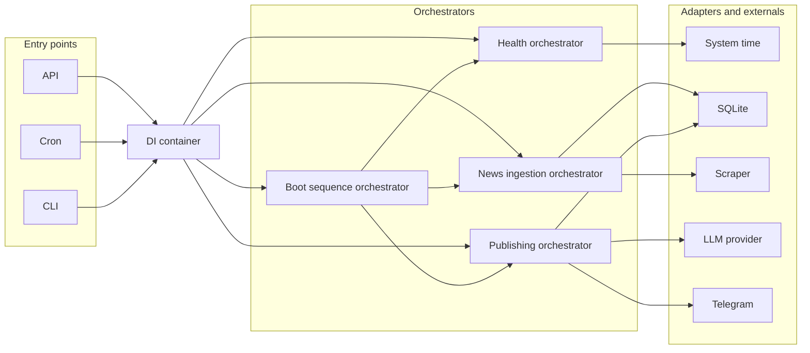
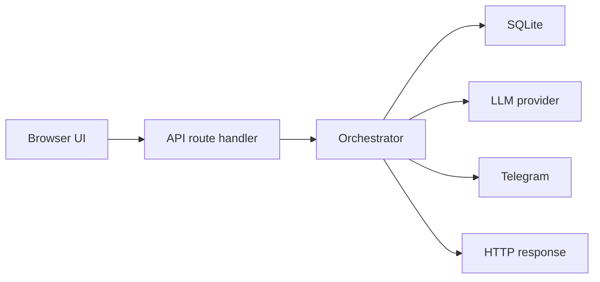
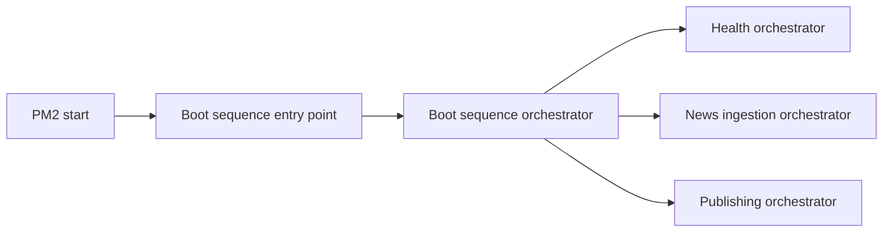

# System architecture diagrams

## Purpose
These diagrams explain the runtime shape of the backend at three levels:

- Big picture: boundaries and ownership (entry points, DI, orchestrators, adapters).
- API request: how a browser request becomes a use case execution.
- Boot sequence: how PM2 triggers deterministic startup ordering.

## Diagram 1: Big picture

## Diagram 2: API request flow

## Diagram 3: PM2 boot sequence flow

