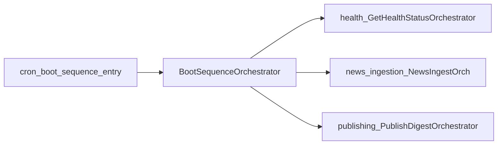

# News pipeline module

This module owns cross-module business flows that do not clearly belong to a single existing module (e.g. boot-time sequencing).

See `docs/modules/news-pipeline.md` for the deep dive.

